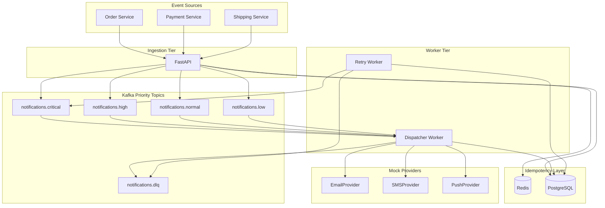

# Notification Engine

High-throughput notification engine for Order, Payment, and Shipping services. Ingests events over HTTP, buffers them in Kafka priority topics, and delivers across email, SMS, and push channels with idempotency, retries, circuit breaking, and partial-failure support.

**Target throughput:** ~50,000 requests/min (~833/sec sustained, ~1,700/sec peak)

## Architecture



## Quick Start

### Run the full stack

```bash
cp .env.example .env
make up
make migrate   # first run only (or run inside api container)
```

Services:

| Service | Port | Purpose |
|---------|------|---------|
| API | 8000 | FastAPI ingestion + OpenAPI docs |
| Postgres | 5432 | Notification state |
| Redis | 6379 | Idempotency hot path |
| Redpanda | 19092 | Kafka-compatible broker |

Open **http://localhost:8000/docs** for interactive API documentation.

### For local development (without Docker for the API)

```bash
python -m venv .venv
.venv/Scripts/pip install -e ".[dev]"   # Windows
docker compose up -d postgres redis redpanda init-kafka
alembic upgrade head
uvicorn app.main:app --reload --port 8000
```

### Tests

```bash
make test
# or
pytest -v
```

Integration tests require Postgres (`docker compose up -d postgres`).

## API Examples

### Create OTP notification (critical priority → SMS)

```bash
curl -X POST http://localhost:8000/v1/notifications \
  -H "Content-Type: application/json" \
  -H "Idempotency-Key: otp-1" \
  -d '{
    "idempotency_key": "otp-1",
    "source_service": "payment",
    "event_type": "otp",
    "user_id": "u1",
    "channels": ["sms"],
    "payload": {"code": "123456"}
  }'
```

Response `202`:

```json
{"notification_id": "...", "status": "Pending", "created": true}
```

### Multi-channel order confirmation

```bash
curl -X POST http://localhost:8000/v1/notifications \
  -H "Content-Type: application/json" \
  -d '{
    "idempotency_key": "ord-1",
    "source_service": "order",
    "event_type": "confirmed",
    "user_id": "u1",
    "channels": ["email", "push"],
    "payload": {"order_id": "O-99"}
  }'
```

### Check status (partial failure demo)

```bash
curl http://localhost:8000/v1/notifications/{notification_id}
```

Returns parent status plus per-channel delivery rows — useful for seeing `PartiallySent` when one channel succeeds and another retries.

### Duplicate request

Repeating the same `idempotency_key` returns **HTTP 200** with the existing notification and does **not** re-publish to Kafka.

## Priority Mapping

| Priority | Example events | Kafka topic |
|----------|----------------|-------------|
| CRITICAL | payment/otp, payment/fraud_alert | `notifications.critical` |
| HIGH | order/confirmed, shipping/delivered | `notifications.high` |
| NORMAL | default | `notifications.normal` |
| LOW | order/marketing | `notifications.low` |

The dispatcher worker polls topics in strict priority order: critical → high → normal → low.

## Idempotency

1. Client sends `Idempotency-Key` header (or `idempotency_key` in body).
2. **Redis fast path:** `SET idempotency:{key} NX EX 86400`. Duplicate → return existing notification.
3. **PostgreSQL strong guarantee:** unique index on `idempotency_key` with `ON CONFLICT DO NOTHING`.
4. Kafka publish happens **only after** the DB row is created.

## Retry & Failure Handling

| Mechanism | Behavior |
|-----------|----------|
| Exponential backoff | 30s → 2m → 10m → 30m → 2h |
| Max attempts | 5 per channel, then `Failed` |
| Circuit breaker | 5 consecutive failures opens circuit for 60s |
| Retry worker | Polls `Retrying` deliveries every 10s, re-publishes to Kafka |
| DLQ | After max attempts → `notifications.dlq` + `Failed` in DB |

Partial failures are tracked **per channel**. Email success + SMS down → parent `PartiallySent`.

## Project Structure

```
app/
├── api/routes/          # HTTP endpoints
├── core/priority.py     # Event → priority/topic mapping
├── db/                  # SQLAlchemy session, repository, Redis
├── domain/              # Enums, ORM models, Pydantic schemas
├── messaging/           # Kafka producer/consumer, message encoding
├── providers/           # NotificationProvider ABC + mocks
├── services/            # Idempotency, dispatcher, retry scheduler
└── workers/             # Dispatcher + retry background workers
```

## Makefile Commands

| Command | Description |
|---------|-------------|
| `make up` | Start all Docker services |
| `make down` | Stop stack |
| `make migrate` | Run Alembic migrations |
| `make test` | Run pytest |
| `make seed` | POST sample events to the API |
| `make logs` | Tail api/worker logs |

## Scaling Notes (50k/min)

```
50,000 req/min ÷ 60 ≈ 833 events/sec sustained
Peak (2×)     ≈ 1,700 events/sec
```

## Environment Variables

See [`.env.example`](.env.example) for all settings including mock provider failure rates:

```bash
MOCK_SMS_DOWN=true          # demo SMS outage / partial failure
MOCK_EMAIL_FAILURE_RATE=0.3 # 30% simulated email failures
```

